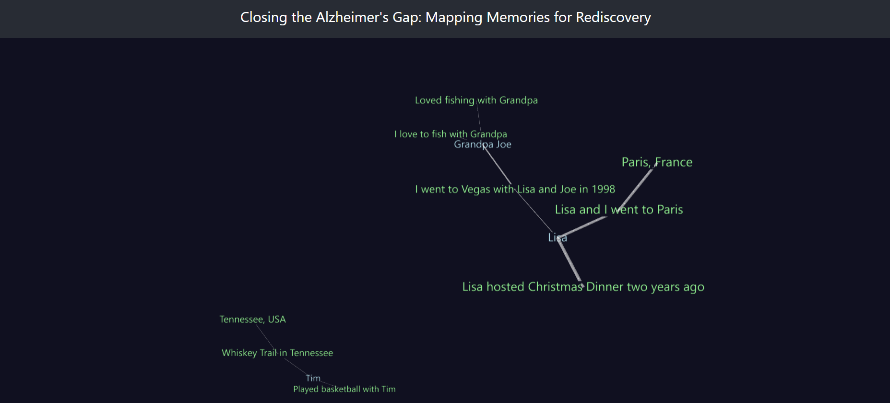

# memory-bridge

  
  
"Together, always"

  

# 🧠 Memory Bridge AI

## Project Overview
Memory Bridge AI is an AI-powered memory reinforcement system designed to help individuals in care facilities strengthen recall and rediscover past memories. Unlike traditional chatbots, it builds an evolving memory graph that tracks relationships between people, places, and events, reinforcing weaker memories and integrating family-uploaded images for rediscovery.

## Key Features
- **Graph-Based Memory Storage**  
  Creates a **network of linked memories** to visualize and strengthen connections.
- **Conversational Memory Recall**  
  AI **remembers past interactions** and revisits them for **reinforcement**.
- **Adaptive Recall & Testing**  
  Utilizes **incremental difficulty** (Recognition → Cued Recall → Free Recall), informed by modern memory therapies.
- **Image Upload & Rediscovery**  
  Family members upload photos, which the AI **uses as personalized memory prompts**.
- **Memory Graph Visualization**  
  The system **dynamically updates in real-time** to show how memories connect and evolve.

---

## Technical Goals & MVP Features

### 1. Research-Backed Memory Therapy Integration
- **Reminiscence Therapy (RT)**  
  - Facilitates uploading personal photos/stories, prompting guided reminiscing.  
  - Targets mood improvement, sense of identity, and social engagement.
- **Spaced Retrieval Therapy (SRT)**  
  - Automates recall testing at **increasing intervals** for memory retention.  
  - Employs **errorless learning** to reinforce important facts or routines.
- **Cognitive Stimulation Therapy (CST)**  
  - Offers **interactive mini-games** and conversation topics, fostering cognitive engagement.  
  - Encourages **social or family involvement** in exercises.

### 2. Memory Graph & Data Handling
- **NetworkX or Similar**  
  - MVP uses a lightweight graph structure (e.g., JSON + NetworkX) to store and visualize nodes (people, events, places).  
  - Potential upgrade to **Neo4j** for larger-scale or advanced querying.
- **Secure Storage**  
  - Stores user data, memory entries, and therapy progress in a **privacy-compliant** manner (plan for HIPAA/HITRUST if integrated clinically).  
  - Potential encryption of images and personal stories.

### 3. Adaptive AI & User Interaction
- **Conversational AI**  
  - Powered by **OpenAI GPT-4** (or Mistral-7B) with a conversation flow orchestrated via **LangChain**.  
  - Tracks user inputs, references memory graph to keep context.
- **Recall Logic & Confidence Tracking**  
  - Monitors user responses, flags potential **memory inconsistencies**, and adjusts prompt difficulty.  
  - Helps avoid reinforcing false memories.
- **Frontend & Visualization**  
  - **Flask** (or similar) for the core web UI.  
  - **Plotly Dash** or an equivalent framework for **interactive graph visualizations**.
- **Caregiver Dashboard**  
  - Tracks user engagement (frequency, recall scores).  
  - Issues alerts if engagement declines, potentially indicating cognitive changes.

### 4. MVP Deliverables
- **Reminiscence Module**  
  - Upload personal media, present memory prompts, record user stories.  
  - Basic data analytics on engagement (e.g., how many stories recorded).
- **Spaced Retrieval Module**  
  - Automated intervals for recall quizzes (errorless learning).  
  - Performance-based scheduling (success = longer interval; failure = immediate reteach).
- **Cognitive Stimulation Activities**  
  - Rotating set of mini-games or conversation prompts for mild-to-moderate dementia.  
  - Optionally incorporate **music therapy** triggers (tagging memories with songs).
- **Graph Visualization & Updates**  
  - Real-time node/edge creation (people, places, events).  
  - Clear interface for caregivers or clinicians to see memory “clusters” and recall strength.

---

## Academic Backing & Efficacy
Memory Bridge integrates **three evidence-based therapies**—Reminiscence Therapy, Spaced Retrieval Therapy, and Cognitive Stimulation Therapy—to reinforce cognitive function and recall in individuals with Alzheimer’s or related dementias.

1. **Reminiscence Therapy (RT)**
   - Studies show **improved mood** and **mild cognitive benefits** when older adults recall meaningful personal memories.
   - Digital RT tools have demonstrated feasibility and positive social engagement outcomes.

2. **Spaced Retrieval Therapy (SRT)**
   - Empirical evidence supports **longer retention** of newly learned info through repeated, spaced recall.
   - Especially effective for **name-face associations** and daily routines in mild-to-moderate Alzheimer’s.

3. **Cognitive Stimulation Therapy (CST)**
   - Recommended by dementia guidelines (e.g., NICE in the UK) for **maintaining global cognition**.
   - Digital CST implementations have shown promising adherence and engagement, though variety and personalization are key.

**Why This Matters:**  
- **24/7 digital availability** allows consistent, short, targeted sessions, potentially outperforming once-a-week therapy.  
- **Adaptive AI** personalizes difficulty and content, improving motivation and success rates.  
- Integrating memory therapies with a **visual, evolving memory graph** provides emotional resonance (family photos, stories) and a practical caregiver tool.

---

**Memory Bridge AI** aspires to **improve daily life** for individuals with dementia or related conditions by **combining proven memory therapies** with **modern AI** and **data tracking**. Through personalized, adaptive engagement and robust caregiver support tools, we aim to **surpass traditional methods** and enable higher-quality, research-backed memory care in any setting.
